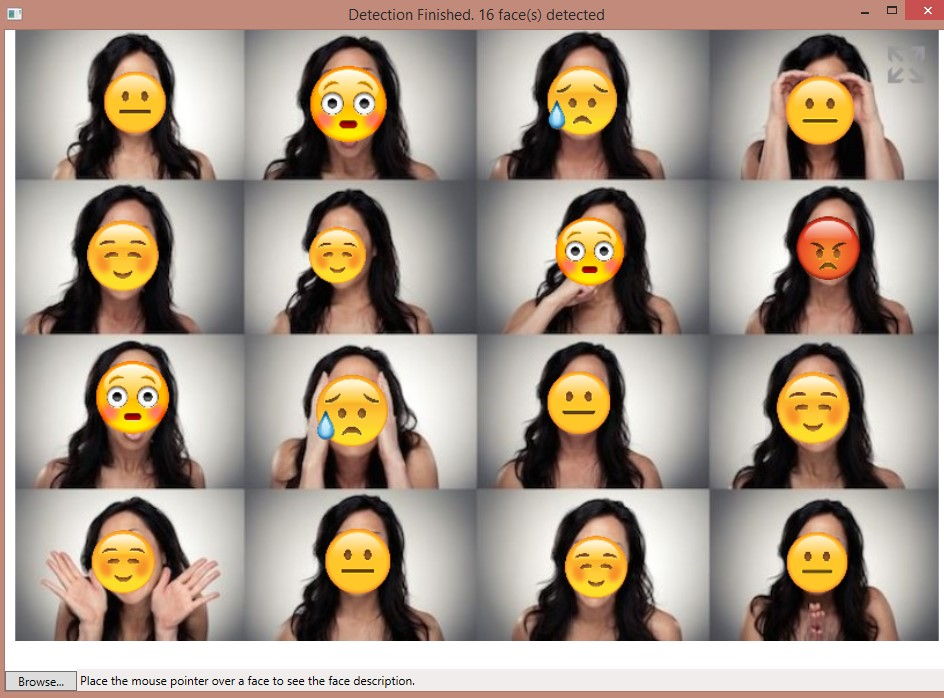

# Emotion-Detection-With-Emoji-And-Music
Uses Microsoft face detection API to detect emotions and then replace faces with appropriate images.


## How to install

1. Clone the repo

```bash
$ git clone https://github.com/uditiarora/Emotion-Detection-With-Emoji-And-Music
```

2. Import to visual studio and run!

## Screenshots

##### Input


##### Output



